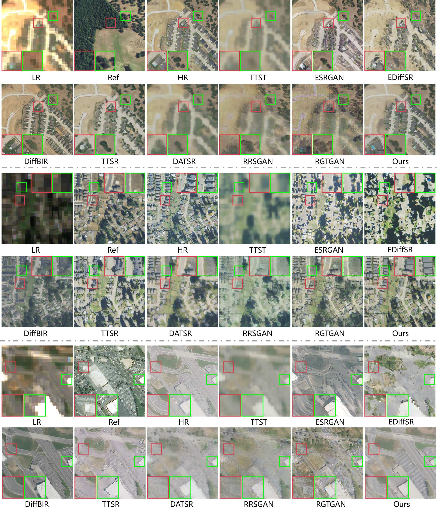
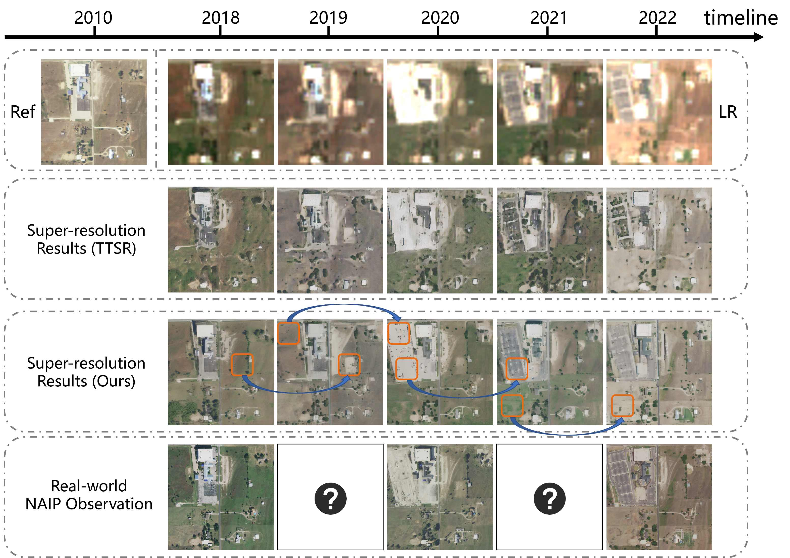
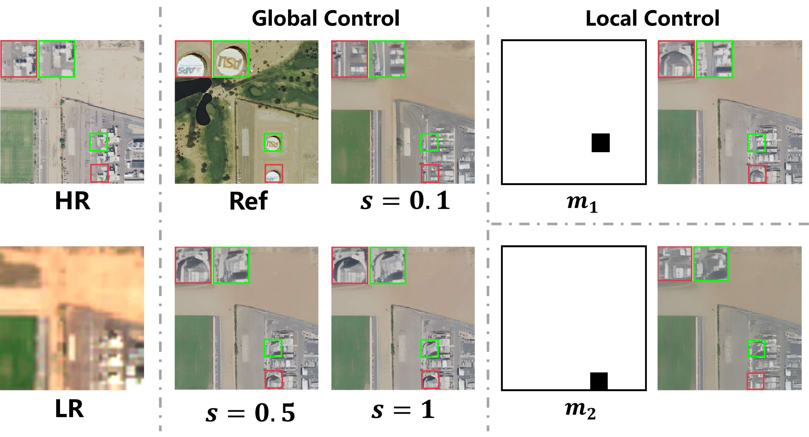
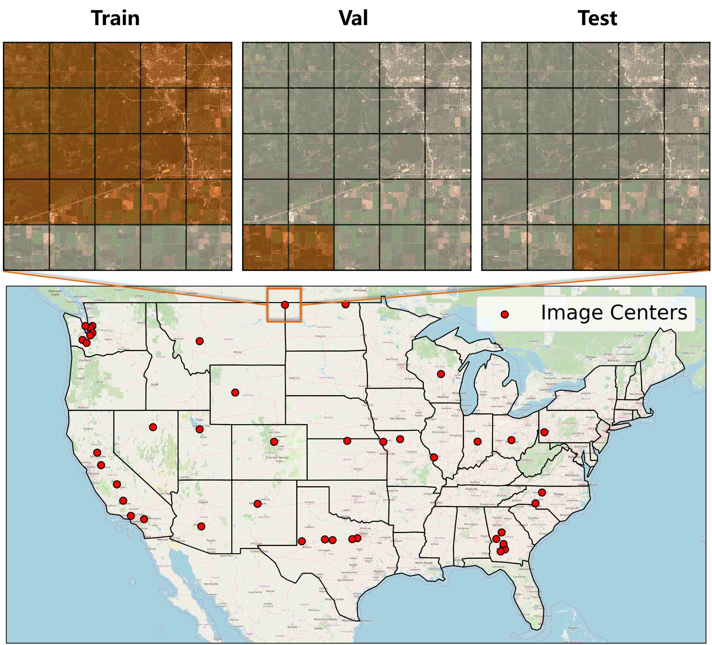
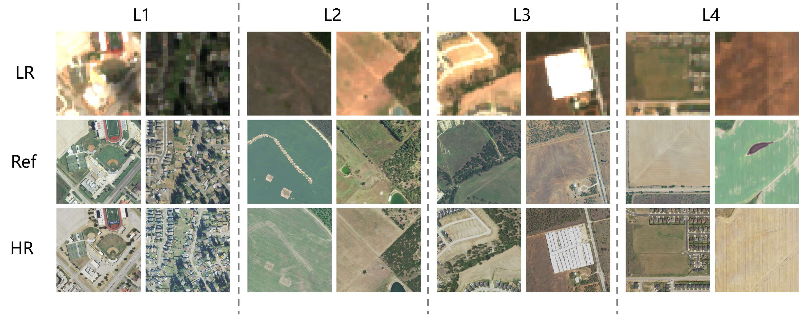

<h2 align="center">Controllable Reference-Guided Diffusion with Local–Global Fusion for Real-World Remote Sensing Image Super-Resolution</h2>

<div align="center">

<a href="https://arxiv.org/abs/2506.23801"></a>       

[Ce Wang]()<sup>1</sup>, [Wanjie Sun]()<sup>1</sup>
<br>
<sup>1</sup>School of Remote Sensing and Information Engineering, Wuhan University

</div>

<p align="center">
    
</p>

---

## 📚 Table of Contents

* [Visual Results](#visual_results)
* [Installation](#installation)
* [Pretrained Models](#pretrained_models)
* [Dataset](#dataset)
* [Inference](#inference)
* [Citation](#citation)
* [Acknowledgements](#acknowledgements)
* [Contact](#contact)

---

## <a name="visual_results"></a>👁️ Visual Results

### Results Real-RefRSSRD



### For High Spatialtempoal Image Generation



### Results of Global-Local Control



---

## <a name="installation"></a>⚙️ Installation

```bash
# Clone this repository
git clone https://github.com/wwangcece/CRefDiff.git

# Create a conda environment with Python >= 3.9
conda create -n CRefDiff python=3.9
conda activate CRefDiff

# Install required packages
pip install -r requirements.txt
```

---

## <a name="pretrained_models"></a>🧬 Pretrained Models

Download the pretrained models from the link below and place them in the `checkpoints/` directory:

[Download from HuggingFace](https://huggingface.co/wangcce/RefSR_x10)

---

## <a name="dataset"></a>📊 Dataset
### Geographic Coordinate Sampling Points
<p align="center">
    
</p>

### Data Samples
<p align="center">
    
</p>

1. Refer to the [Real-RefRSSRD](https://huggingface.co/datasets/wangcce/Real-RefRSSRD) for downloading.
2. Use the script `dataset/prepare_lr.py` to upscale the LR images to match the size of HR.

---

## <a name="inference"></a>⚔️ Inference

1. Modify the validation dataset configuration in `configs/dataset/reference_sr_test.yaml` and update the pretrained model path in `inference_refsr_batch.py`.
2. Run the inference script:

```bash
python inference_refsr_batch.sh --ckpt path/to/pretrained/model --output path/tp/out/dir --global_ref_scale 1 --device cuda:0 
```

---

---

## <a name="citation"></a>📖 Citation

If you find this work helpful, please consider citing:

```bibtex
@misc{wang2025controllablereferencebasedrealworldremote,
      title={Controllable Reference-Based Real-World Remote Sensing Image Super-Resolution with Generative Diffusion Priors}, 
      author={Ce Wang and Wanjie Sun},
      year={2025},
      eprint={2506.23801},
      archivePrefix={arXiv},
      primaryClass={cs.CV},
      url={https://arxiv.org/abs/2506.23801}, 
}
```

---

## <a name="acknowledgements"></a>🙏 Acknowledgements

This project is based on [DiffBIR](https://github.com/XPixelGroup/DiffBIR). We thank the authors for their excellent work.

---

## <a name="contact"></a>📨 Contact

If you have any questions, feel free to reach out to:
**Ce Wang** — [cewang@whu.edu.cn](mailto:cewang@whu.edu.cn)
